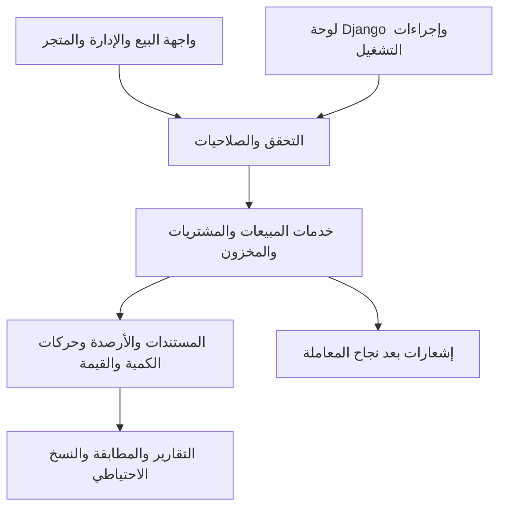

# تقرير مراجعة نظام إدارة قطع غيار السيارات

**تاريخ المراجعة: 7 أكتوبر 2026.**

**القرار: النسخة الحالية غير جاهزة للتشغيل التجاري بأرصدة حقيقية.** السبب الأساسي هو وجود أخطاء مثبتة تخلّ بالمخزون والتكلفة وتسمح بتجاوز سجل الحركات. يمكن تطوير النظام الحالي؛ لا تظهر حاجة إلى إعادة بنائه من الصفر.

المراجعة تخص شجرة العمل الموجودة على الجهاز، بما فيها تغييرات سابقة غير محفوظة في آخر التزام Git. أضيفت ملفات مراجعة واختبارات مستقلة فقط؛ لم تُنفذ إصلاحات في التطبيق، ولم تُستخدم قاعدة بيانات المتجر في تجارب البيع والحذف. البريد في التجارب بقي داخل الذاكرة ولم يُرسل إلى أي جهة.

## 1. النطاق وما أُنجز

أُجريت قراءة للمسارات الأساسية في النماذج والخدمات والتحويل والتحقق والصلاحيات والإدارة والإعدادات، وفحص مرئي لصفحات الدخول والبيع والمخزون والمتجر، وبيع نقدي تجريبي كامل. شملت الاختبارات SQLite وPostgreSQL مؤقتًا، وبناء الواجهة من نسخة نظيفة، وقياس البحث بكتالوج من 10 آلاف صنف.

| الفحص | النتيجة |
|---|---|
| اختبارات الخادم الحالية | نجحت 81 على SQLite، ونجحت أيضًا ضمن تشغيل PostgreSQL |
| اختبارات الواجهة الحالية | نجحت 28، موزعة على السلة والعملة وروابط الصور |
| فحص الواجهة والبناء | نجحا في المشروع وفي نسخة مؤقتة بعد `npm ci --offline --ignore-scripts` |
| إعدادات الإنتاج الأمنية | `check --deploy` مع `DEBUG=False`: بلا ملاحظات من الفاحص |
| توافق النماذج والترحيلات | `makemigrations --check --dry-run`: لا تغييرات ناقصة |
| اختبارات سلامة إضافية | 14 من 15 سيناريو فشلت في استيفاء معيار السلامة؛ تُفصّل أدناه |
| البيع المتزامن على PostgreSQL | نجحت عملية واحدة ورُفضت الثانية عند بيع آخر قطعة |
| إلغاء طلب مؤكد وتكرار التأكيد والإلغاء | عاد الرصيد إلى قيمته الصحيحة دون خصم أو إرجاع إضافي |
| استعادة تجريبية | تطابقت سجلات قاعدة SQLite المنسوخة وملف صورة تجريبي بعد الاستعادة |

البيئة المستخدمة: Python 3.13.13، Django 5.2.17، Node 26.8.2، Vite 8.0.3. نجح التثبيت النظيف للواجهة من التخزين المحلي للحزم؛ لم يُجر تثبيت نظيف مستقل لجميع اعتماديات Python، أو تدقيق شبكي حديث لثغرات الحزم. نجاح الفحوص الأساسية لا يغطي الأخطاء التجارية التي أثبتتها الاختبارات الجديدة.

**الأدلة المحفوظة:** [اختبارات PostgreSQL](/Users/macbookairm1/Desktop/pos/reviews/2026-10-07/postgresql-check-results.txt)، [اختبارات إضافية وقياس الأداء](/Users/macbookairm1/Desktop/pos/reviews/2026-10-07/extended-check-results.txt)، [اختبار إشعار الطلب](/Users/macbookairm1/Desktop/pos/reviews/2026-10-07/notification-check-results.txt)، [نتيجة الاستعادة](/Users/macbookairm1/Desktop/pos/reviews/2026-10-07/restore-check-results.json).

## 2. نقاط القوة التي ينبغي الحفاظ عليها

- فصل معظم عمليات المخزون في خدمات ذرية، مع قفل الصفوف. اختبار اتصالين مستقلين على PostgreSQL أثبت حماية آخر قطعة في السيناريو المختبر.
- تسجيل سعر التكلفة وقت البيع بدل الاعتماد على سعر شراء يتغير لاحقًا، واستخدام المتوسط المرجح عند التوريد.
- منع تعديل وحذف فواتير البيع عبر API، وحماية القطع المرتبطة بالفواتير وحركات المخزون من الحذف.
- مصادقة بكوكيز HttpOnly، وصلاحيات للتقارير والمستخدمين، والتحقق من الصور وكلمات المرور وإعدادات HTTPS.
- واجهة عربية متماسكة، وبحث برقم القطعة وموقع الرف، وبداية عملية لتوافق السيارات والموردين والعملاء.
- اختبارات حالية وملف بناء آلي. توجد بنية قابلة للتحسين تدريجيًا، مع ضرورة سد المسارات التي تتجاوز الخدمات.

## 3. موانع التشغيل — P0

### P0-01: تكرار الصنف داخل الفاتورة يسمح ببيع كمية غير متوفرة

**الدليل:** رصيد 10؛ أُرسلت فاتورة ببندين للصنف نفسه، كمية كل منهما 6. استجاب الخادم بـ201، وسجل بيع 12 وحركات مجموعها −12، لكن الرصيد النهائي بقي 4. كل بند احتفظ بنسخة مستقلة من رصيد القطعة قبل بدء الخصم. العيب ظهر على SQLite وPostgreSQL.

**الموقع:** [تحضير بنود الفاتورة](/Users/macbookairm1/Desktop/pos/backend/api/services.py:166) و[تطبيق الخصم](/Users/macbookairm1/Desktop/pos/backend/api/services.py:207). إعادة الإثبات: `review_checks.test_01`.

**الإصلاح المطلوب:** جمع الكميات حسب معرف الصنف أو رفض تكراره، وقفل الأصناف بترتيب ثابت، واستخدام نسخة واحدة حديثة لكل صنف. **القبول:** يُرفض طلب 12 من رصيد 10 دون فاتورة أو حركة؛ وينجح بيع 8 ببندين مع رصيد نهائي 2 وسجل متطابق.

### P0-02: لوحة Django تتجاوز خدمات المخزون

**الدليل:** مسار حفظ القطعة في الإدارة غيّر الرصيد من 10 إلى 17 دون حركة واحدة. حذف توريد أضاف قطعتين من مسار الإدارة أبقى الرصيد 12، بينما الخدمة الصحيحة تعيده إلى 10. تغيير حالة الطلب وبنوده متاح أيضًا في الإدارة دون ربطه بخدمات التأكيد والإلغاء.

**الموقع:** [إدارة القطع](/Users/macbookairm1/Desktop/pos/backend/api/admin.py:70)، [إدارة التوريد](/Users/macbookairm1/Desktop/pos/backend/api/admin.py:146)، [إدارة الطلبات](/Users/macbookairm1/Desktop/pos/backend/api/admin.py:197). إعادة الإثبات: `test_09` و`test_10` اختبرا مساري الإدارة المسجلين؛ لم يكن الاختبار مجرد تعديل مباشر في قاعدة البيانات.

**الإصلاح المطلوب:** جعل الرصيد والتكلفة والحالة والبنود الحساسة للقراءة فقط، ومنع إنشاء وحذف العمليات المالية مباشرةً، أو تنفيذ إجراءات إدارة صريحة تستدعي الخدمات نفسها، بما فيها الحذف الجماعي. **القبول:** لا توجد وسيلة إدارة تغير المخزون أو الحالة المالية دون حركة صحيحة ومرجع ومستخدم.

### P0-03: عكس التوريد لا يعكس تكلفة المخزون

**الدليل:** 10 قطع بتكلفة 10؛ توريد 10 أخرى بتكلفة 30 رفع المتوسط إلى20. حذف التوريد أعاد العدد إلى10 وأبقى المتوسط20؛ يصبح تقييم الرصيد200 بدل100، وتتأثر تكلفة المبيعات القادمة.

**الموقع:** [عكس التوريد](/Users/macbookairm1/Desktop/pos/backend/api/services.py:355). إعادة الإثبات: `test_05`.

**الإصلاح المطلوب:** اعتماد سياسة إلغاء محاسبية موثقة، تحفظ الحركة الأصلية وتعكس الكمية والقيمة بطريقة متسقة مع المبيعات اللاحقة. لا يكفي طرح كمية التوريد من الرصيد. **القبول:** التجربة البسيطة تعيد العدد10 والتكلفة10؛ وتُراجع حالات البيع والتوريد اللاحق مع محاسب قبل السماح بالإلغاء.

### P0-04: حذف المورد يمحو تاريخ التوريد

**الدليل:** حذف المورد عبر API أعاد204 وحذف سجل توريده تلقائيًا، مع بقاء القطع المضافة في المخزون. يُفقد مستند يفسر مصدر الرصيد وتكلفته.

**الموقع:** [علاقة المورد بالتوريد](/Users/macbookairm1/Desktop/pos/backend/api/models.py:424). إعادة الإثبات: `test_06`.

**الإصلاح المطلوب:** حماية المورد المرتبط بتاريخ شراء وتعطيله بدل حذفه، أو الاحتفاظ بالمستند وهوية المورد التاريخية. **القبول:** لا يمحو حذف أو تعطيل مورد مستندات توريد أو مراجع الحركات، سواء من API أو الإدارة.

### P0-05: إعادة محاولة البيع تنشئ فاتورة ثانية

**الدليل:** أُرسل الطلب نفسه مرتين مع مفتاح إعادة محاولة واحد؛ أنشأ الخادم فاتورتين وخصم قطعتين. تعطيل زر البيع في الواجهة لا يعالج حالة نجاح العملية في الخادم وانقطاع الرد قبل وصوله للمستخدم.

**الموقع:** [إنشاء الفاتورة](/Users/macbookairm1/Desktop/pos/backend/api/services.py:127) و[طلب البيع من الواجهة](/Users/macbookairm1/Desktop/pos/frontend/src/pages/POS.jsx:127). إعادة الإثبات: `test_07`.

**الإصلاح المطلوب:** معرف عملية ثابت تنشئه الواجهة، مع قيد فريد وحفظ ذري للنتيجة في الخادم. **القبول:** التكرار المتتابع والمتزامن يعيد الفاتورة الأصلية ويخصم مرة واحدة؛ استخدام المفتاح نفسه بمحتوى مختلف يُرفض.

## 4. أخطاء مهمة قبل التشغيل الواسع — P1

### P1-01: التحقق من CSRF غير مطبق على كتابة API بالكوكيز

طلب تسوية مخزون بكتابة موثقة بكوكي JWT، دون رمز CSRF ومع أصل غير موثوق، نجح بـ200 وغيّر الرصيد. الاختبار استخدم عميلًا مفعّلًا فيه فحص CSRF. [المصادقة المخصصة](/Users/macbookairm1/Desktop/pos/backend/api/authentication.py:16) لا تفرض التحقق؛ وجود الوسيط في الإعدادات لم يمنع هذا المسار. `test_04` يثبت ذلك.

الخطر يتوقف على وصول الكوكيز في المتصفح: `SameSite=Lax` يقيّد بعض الطلبات بين المواقع، لكنه لا يجعل مسار الكتابة نفسه محميًا، ويزداد الاعتماد على الحماية الصريحة عند تغيير إعدادات النشر. لا تُعد نتيجة العميل إثباتًا أن كل هجوم خارجي ينجح تحت جميع إعدادات المتصفح.

**المطلوب والقبول:** حماية الكتابة والمصادقة بالآلية المناسبة للكوكيز، وإرسال الرمز من الواجهة؛ يُرفض الطلب دون رمز أو بأصل غير موثوق ويُقبل الطلب الصحيح. مرجع التحقق: [توثيق DRF للمصادقة وCSRF](https://www.django-rest-framework.org/api-guide/authentication/).

### P1-02: الموظف يحصل على تكلفة القطع وربح الفاتورة

`test_02` أعاد `purchase_price=10.00` للموظف، و`test_03` أعاد تكلفة وربح بند فاتورته. منع صفحة التقارير لا يحجب هذه البيانات من API. مسار البحث والحركات وتفاصيل المورد يحتاج تطبيق سياسة الإخفاء نفسها.

**الموقع:** [بيانات قائمة القطع](/Users/macbookairm1/Desktop/pos/backend/api/serializers.py:176) و[بنود الفاتورة](/Users/macbookairm1/Desktop/pos/backend/api/serializers.py:201). **القبول:** لا تصل حقول التكلفة والربح للموظف في أي استجابة، وفق سياسة المنتج المعتمدة، مع بقاء بيانات البيع المطلوبة.

### P1-03: فتح المتجر مباشرةً كزائر يحوّل إلى دخول الموظفين

عند فتح `/shop` دون جلسة، ينفذ مزود المصادقة فحص المستخدم؛ يفشل التحديث ثم يعيد المعترض توجيه كل مسار عدا `/` و`/login`. ثبت الانتقال إلى `/login` في المتصفح. يتأثر كذلك فتح تفاصيل المنتج مباشرةً.

**الموقع:** [قرار إعادة التوجيه](/Users/macbookairm1/Desktop/pos/frontend/src/api/axios.js:77). **القبول:** صفحات المتجر والتفاصيل تبقى عامة عند عدم تسجيل الدخول أو انتهاء الجلسة؛ الصفحات الداخلية وحدها تتطلب الدخول.


### P1-04: نموذج تعديل القطعة يبدأ ببيانات ناقصة

القائمة تعيد أسماء الفئة والسيارات، لكنها لا تعيد معرف الفئة أو معرفات السيارات أو حد التنبيه. نموذج التعديل يستخدم سجل القائمة مباشرةً؛ ظهر في المتصفح بفئة فارغة، والسيارة غير محددة، وحد تنبيه فارغ رغم وجودها في السجل. `test_14` أثبت غياب الحقول الثلاثة من بيانات القائمة. قد يفشل الحفظ أو يؤدي إدخال قيم جديدة بدل القديمة إلى تغيير غير مقصود.

**الموقع:** [فتح نموذج التعديل](/Users/macbookairm1/Desktop/pos/frontend/src/pages/SpareParts.jsx:107). **القبول:** تحميل التفاصيل قبل التعديل، أو توفير عقد بيانات كافٍ؛ فتح النموذج ثم حفظه بلا تغييرات يحافظ على جميع القيم والعلاقات.


### P1-05: الواجهة تسمح بكمية وتكلفة لا يطبقها الخادم

إضافة قطعة بكمية7 نجحت بـ201 وأعادت رصيد0 في `test_13`. نموذج القطعة يرسل كمية المخزون، مع أن الحقل للقراءة فقط. ويتيح تعديل تكلفة الشراء رغم جعلها للقراءة فقط عند التحديث. لا ينبغي إعادة السماح بالكتابة المباشرة لحل المشكلة.

**الموقع:** [حفظ نموذج القطعة](/Users/macbookairm1/Desktop/pos/frontend/src/pages/SpareParts.jsx:129) و[قيود الحقول](/Users/macbookairm1/Desktop/pos/backend/api/serializers.py:156). **القبول:** رصيد افتتاحي عبر خدمة وحركة موثقة، وتوريد أو تسوية مستقلة؛ لا تعرض الواجهة نجاح تغيير تجاهله الخادم.

### P1-06: العملات المختلفة تُجمع في تقرير واحد بلا تحويل

فاتورة20 SDG وأخرى20 USD أعطتا إيراد40 دون عملة أو تحويل. حقل العملة يقبل الوسمين بينما أسعار الأصناف غير مرتبطة بعملة وسعر صرف. `test_08` يثبت الخلط.

**الموقع:** [تقرير الإيرادات](/Users/macbookairm1/Desktop/pos/backend/api/views.py:680). **القبول:** قبل دعم التحويل، قصر النظام على عملة مؤسسة واحدة والتحقق منها في API. عند التوسع: عملة أساسية، وعملة المستند، وسعر صرف وتاريخ ودقة وتقريب، وتقارير مفصولة أو محولة بقاعدة معلنة.

### P1-07: القوائم الداخلية والبحث عن العملاء تتوقف عند الصفحة الأولى

نقطة البيع تحمل أول50 عميلًا وتبحث داخلهم محليًا. مع65 عميلًا تجريبيًا، لم يظهر العميل064 رغم وجوده. قائمة العملاء والفواتير كذلك تحمل `results` دون متابعة `next`؛ والمراجع في تعديل القطعة تحمل100 سجل فقط.

**الموقع:** [تحميل العملاء في البيع](/Users/macbookairm1/Desktop/pos/frontend/src/pages/POS.jsx:39)، [قائمة العملاء](/Users/macbookairm1/Desktop/pos/frontend/src/pages/Customers.jsx:34)، [قائمة الفواتير](/Users/macbookairm1/Desktop/pos/frontend/src/pages/Invoices.jsx:14). **القبول:** البحث في الخادم والتصفح الكامل؛ تظهر السجلات خارج الصفحة الأولى ويستطيع المستخدم العثور على الفواتير القديمة.

### P1-08: كتالوج المتجر يُقص إلى500 ويكرر استعلامات الفئة

من10 آلاف صنف أُعيد500 فقط دون عدد إجمالي أو رابط للصفحة التالية. البحث المحدد قد يجد صنفًا خارج هذه المجموعة، لكن التصفح العام أو نتيجة بحث واسعة لا يصلان إلى كامل النتائج. الطلب نفذ502 استعلامًا بسبب حساب عدد قطع الفئة عند تحويل كل منتج.

**الموقع:** [حد الكتالوج](/Users/macbookairm1/Desktop/pos/backend/api/views.py:480) و[حساب العدد للفئة](/Users/macbookairm1/Desktop/pos/backend/api/serializers.py:92). **القبول:** تقسيم صفحات حقيقي، وعدد إجمالي، وعدم حساب العدد باستعلام مستقل لكل منتج؛ قياس جديد على10 آلاف صنف بشروط معلنة.

### P1-09: إيرادات اليوم تستخدم تاريخ UTC عند حدود اليوم المحلي

في الساعة01:30 بتوقيت الخرطوم يوم7 أكتوبر، وهي23:30 UTC يوم6 أكتوبر، لم تُحتسب فاتورة الوقت نفسه في إيرادات اليوم؛ العدد عاد0 بدل1. `test_11` أثبت الحالة.

**الموقع:** [تاريخ اليوم](/Users/macbookairm1/Desktop/pos/backend/api/views.py:262). **القبول:** استخدام تاريخ وحدود يوم المؤسسة المحلي، واختبارات قبل وبعد منتصف الليل في الخرطوم والمنطقة الخليجية المختارة.

### P1-10: الطباعة لا تعزل الفاتورة المختارة ولا توفر قالب إيصال

الكود يضع صنف `printing-target` ثم يستدعي طباعة الصفحة، لكن قواعد الطباعة لا تستخدم هذا الصنف لإخفاء الفواتير الأخرى. لا يوجد إعداد58/80 مم أو قالب يتضمن هوية البائع والحقول الضريبية المطلوبة. هذه ملاحظة مؤكدة من الكود؛ لم تُختبر طابعة فعلية أو دقة معاينة الطباعة.

**الموقع:** [طلب الطباعة](/Users/macbookairm1/Desktop/pos/frontend/src/pages/Invoices.jsx:39) و[تنسيق الطباعة](/Users/macbookairm1/Desktop/pos/frontend/src/index.css:268). **القبول:** طباعة مستند واحد كامل فقط، والتحقق من A4 والإيصال الحراري والعربية على الأجهزة المستهدفة.

### P1-11: إعداد PWA الإنتاجي لا يغطي مسارات التطبيق

البناء الناتج يحتوي `start_url=/` و`scope=/static/`؛ والتسجيل في HTML هو `/static/sw.js` بنطاق `/static/`. مسارات البيع والمتجر عند الجذر تقع خارج هذا النطاق. لم تُجر تجربة تثبيت على هاتف فعلي؛ الدليل هو ملفات البناء الناتجة في النسختين.

كما لا توجد آلية لحفظ عمليات البيع المعلقة أو مزامنتها أو حل تعارض المخزون. حفظ سلة المتجر في التخزين المحلي لا يحقق بيعًا دون اتصال.

**الموقع:** [مسار بناء الواجهة](/Users/macbookairm1/Desktop/pos/frontend/vite.config.js:10). **القبول:** ضبط النطاق والخدمة للتطبيق كاملًا، ثم اختبار التثبيت والانقطاع وإعادة الاتصال على بناء إنتاجي. يُعتمد دعم البيع دون اتصال كميزة مستقلة إذا أثبت السوق الحاجة إليه. مرجع حدود النطاق: [توثيق تسجيل Service Worker](https://developer.mozilla.org/en-US/docs/Web/API/ServiceWorkerContainer/register).

## 5. تحسينات موثقة — P2

1. **إشعار الطلب يسبق إنشاء بنوده:** اختبار خارج معاملة TestCase الخارجية أظهر وصول بريد إلى صندوق الذاكرة بلا اسم القطعة. إنشاء الطلب غير محاط بمعاملة شاملة؛ `on_commit` في الإشارة يُنفذ فور حفظ رأس الطلب في وضع الالتزام التلقائي. الحل: رأس وبنود داخل معاملة واحدة، ثم الإشعار بعد اكتمالها؛ مع اختبار الفشل الجزئي. [إنشاء الطلب](/Users/macbookairm1/Desktop/pos/backend/api/serializers.py:427)، [تأجيل البريد](/Users/macbookairm1/Desktop/pos/backend/api/signals.py:110).
2. **تحذير نقص المخزون لا يظهر للعميل:** الخادم يعيد `stock_warnings`، لكن صفحات الطلب لا تقرأ الاستجابة وتعلن النجاح. الحل: رسالة واضحة بأن الطلب ينتظر تأكيد التوفر، مع عرض البنود غير الكافية. [إرسال الطلب](/Users/macbookairm1/Desktop/pos/frontend/src/pages/FilterPage.jsx:133).
3. **تعطل التحميل يبدو كعدم وجود مخزون:** عند توقف خادم المعاينة، عرضت الصفحة العامة غياب الأقسام والمنتجات بدل خطأ تحميل وزر إعادة المحاولة. البحث في البيع يحول خطأ الشبكة إلى قائمة فارغة أيضًا. الحل: فصل حالات الفشل والفراغ والتحميل، وإلغاء طلب البحث القديم أو تجاهل رده إذا تغيّر الاستعلام.
4. **سهولة الوصول والتنقل:** أزرار تعديل وحذف القطعة بلا اسم متاح لقارئ الشاشة؛ التسميات في عدة نماذج غير مربوطة بالحقول. لا يوجد مسار موثق لاختيار نتيجة البحث بلوحة المفاتيح وإتمام البيع أو قراءة باركود مستقل. يلزم اختبار الموظفين وقارئ باركود فعلي؛ لا يُستنتج عدم عمل جميع القارئات من غياب دعم خاص.
5. **ارتفاع شاشة البيع:** في العرض المكتبي الفعلي كان ارتفاع الصفحة786 مقابل نافذة697، وزر الإتمام أسفل العرض الأول. السبب المحتمل حساب الارتفاع داخل صفحة لها رأس وحشوات. التخطيط الضيق فصل المنتجات والسلة دون تمدد أفقي في العرض المختبر، لكنه يحتاج قياسًا على أحجام الأجهزة الفعلية.
6. **حجم الواجهة وتنظيمها:** حزمة الأيقونات618.27 KB قبل الضغط و154.59 KB بعده، مع استيراد جميع الأيقونات ديناميكيًا في الصفحة العامة؛ جميع الصفحات مستوردة مباشرةً. الملفات الكبيرة، ومنها واجهات الخادم896 سطرًا والصفحة العامة848، تجعل فصل المسؤوليات مفيدًا. تُستخدم مكتبة مشتركة للنماذج والأخطاء والعملة والطباعة، وتحميل الصفحات عند الحاجة؛ لا يُقسم الكود لمجرد عدد الأسطر.
7. **فحوص CI ناقصة:** البناء الآلي يشغل اختبارات الخادم والفحص والبناء، لكنه لا يشغل28 اختبار واجهة أو PostgreSQL أو اختبارات المسارات الكاملة. يلزم إضافتها، خصوصًا الفاتورة والتزامن والكتابة بالكوكيز.
8. **تاريخ المستودع والتوثيق:** ظهر التزام سابق ضمن تاريخ ملفات `.env` وقاعدة SQLite. لا تتعقبها الفهرسة الحالية، لكن ذلك لا يزيل نسخها التاريخية. لم تُقرأ قيم الأسرار أو محتويات قاعدة البيانات التاريخية؛ لا توجد هنا دعوى مثبتة عن تسريب فعلي. يلزم التحقق من نطاق مشاركة التاريخ وتدوير أي أسرار حقيقية سبق نشرها. توثيق عدد الاختبارات في README أقدم من المجموعة الحالية.

## 6. قياس الأداء وحدوده

القياسات على PostgreSQL مؤقت في الجهاز نفسه،10 آلاف صنف، دون شبكة تجارية أو ضغط متعدد المستخدمين. لكل مسار ثلاث عينات؛ الأرقام وصفية وليست اختبار قدرة إنتاجية أو قيمةP95. كتالوج التجربة لم يتضمن صورًا أو توافقات كثيرة، وتقرير المبيعات قيس بلا تاريخ مبيعات كبير.

| المسار | السجلات المعادة | الاستعلامات | الزمن الوسيط |
|---|---:|---:|---:|
| البحث في نقطة البيع |20|22|57.79 مللي ثانية|
| قائمة القطع الداخلية |50|3|42.29 مللي ثانية|
| قائمة المتجر |500|502|2064.15 مللي ثانية|
| تقرير المبيعات الخالي |—|4|9.67 مللي ثانية|

استعلامات بحث البيع الإضافية مرتبطة بقراءة المورد دون تحميله مع الصنف. واجهة المتجر تحتاج معالجة الاستعلامات قبل الاعتماد على الزمن المحلي. لم يُختبر حجم مبيعات سنوي كبير أو شبكة بطيئة فعلية أو عدد كبير من الموظفين.

## 7. الهيكل ونموذج البيانات المقترحان

الاختيار المناسب مبدئيًا هو تطبيق Django واحد بوحدات واضحة، وواجهة React مشتركة؛ لا يوجد دليل يستدعي خدمات مستقلة متعددة الآن. تُفصل مجالات المخزون والمبيعات والمشتريات والمتجر والصلاحيات، وتبقى جميع تغييرات الرصيد والقيمة خلف خدمات مركزية يستخدمها API والإدارة معًا.



| المجال | الفجوة الحالية | التوسعة المطلوبة عند اعتماد النطاق |
|---|---|---|
| هوية الصنف | رقم قطعة عالمي فريد؛ لا فصل واضح بينSKU ورقم المصنع والرقم الأصلي |SKU داخلي، ومصنّع وعلامة ورقم مصنع، وأرقامOEM وبدائل وعلاقة تبادل موثقة|
| توافق السيارة | موديل ومدى سنوات فقط |محرك وفئة وهيكل وجهة وتركيب عند الحاجة؛ بيانات توافق موثوقة ومصدر مرخص|
| وحدات البيع | كميات صحيحة فقط، بلا عبوة أو معامل تحويل |وحدات وعبوات وتحويلات؛ دعم الكميات الكسرية للأصناف التي تحتاجها|
| المخزون | رصيد واحد وموقع رف نصي |مخازن وفروع وحجز وتحويل وجرد معتمد إذا كانت مطلوبة|
| الشراء | سجل توريد لصنف واحد |رأس مستند شراء وبنوده وعملة ومصاريف شحن وتخليص وتوزيع تكلفة|
| البيع | فاتورة مباشرة بلا مستند مرتجع أو رصيد عميل |مرتجعات جزئية وكاملة وإشعارات تسوية ودفعات وآجل وحد ائتمان|
| التقارير | الإيراد مبني علىInvoice فقط |حسم متى يتحول الطلب الإلكتروني إلى بيع محاسبي وكيف يدخل التقرير دون تكرار|
| السجل التاريخي | التكلفة محفوظة، لكن أسماء القطع والعملاء تُقرأ من العلاقات الحالية |لقطات بيانات هوية البائع والمشتري والصنف والضريبة والوحدة والعملة عند الإصدار|
| خدمة عدة شركات | لا توجد حدود مؤسسة أو عزل بيانات في النموذج الحالي |عزل شركات وصلاحيات وفروع واختبارات منع الوصول بين الشركات قبل بيع خدمة مشتركة|

البحث برقم الهيكلVIN ليس حقلًا يضاف فقط؛ يلزم أولًا تحديد مصدر بيانات التوافق وحقوق استخدامه وكلفة تحديثه. لا يثبت وجود أسماء السيارات وحده صحة تركيب القطعة على كل سيارة ضمن السنوات.

## 8. مناسبة السوق السوداني والخليجي

### السودان

**نقطة البداية المناسبة:** محل قطع غيار واحد، بيع نقدي أو تحويل، مخزون مركزي، بشرط إصلاح موانع السلامة وتحديد المتطلبات الضريبية التي تنطبق على العميل. العربية والجنيه السوداني ورقم إشعار التحويل عناصر مناسبة لهذه البداية؛ تسجيل التحويل يدويًا لا يثبت تسويته البنكية آليًا.

**الفجوات المؤثرة:** المرتجعات والآجل والتحصيل الجزئي، وتكلفة الاستيراد بالعملة الأجنبية، وتغير أسعار الشراء، وتشغيل موثوق عند انقطاع الاتصال إن أثبتته مقابلات المحلات. لا توجد حاليًا آلية تحويل تكلفة أو مزامنة بيع دون اتصال.

بالنسبة للمنشآت الخاضعة، يوضح [ديوان الضرائب السوداني متطلبات الفواتير والسجلات](https://tax.gov.sd/%D8%A7%D9%84%D9%82%D9%8A%D9%85%D8%A9-%D8%A7%D9%84%D9%85%D8%B6%D8%A7%D9%81%D8%A9/)، ومنها بيانات البائع والمشتري والتسجيل والضريبة وسجلات المردودات. النموذج الحالي لا يمثل هذه البيانات بما يكفي. يلزم تأكيد الانطباق وآخر التعديلات مع محاسب محلي قبل اعتبار الفاتورة معتمدة؛ لم تُثبت نسبة ضريبة واحدة لجميع العملاء في هذه المراجعة.

### السعودية

**القرار:** غير جاهز كحل فوترة تجاري سعودي كامل. لا يظهر في المشروع نموذج ضريبي أو توليدXML أو تكاملZATCA أو دورة إشعارات تسوية تغطي المتطلبات. تطبق المرحلة الثانية على المجموعات المشمولة، وتشمل صيغة الفواتير والربط بحسب متطلبات الهيئة. المرجع: [المواصفات الرسمية للفوترة الإلكترونية](https://www.zatca.gov.sa/ar/e-invoicing/systemsdevelopers/pages/e-invoice-specifications.aspx).

المطلوب: ملف دولة لإعدادات العملة والضريبة وهوية المنشأة والفاتورة، وتكامل معتمد ومختبر للمسار الذي ينطبق على العميل، مع الدفع بالبطاقات والفروع إذا طلبتها الشريحة. لم يُختبر النظام لدى الهيئة أو تُحدد مجموعة عميل بعينه.

### الإمارات

**القرار:** غير جاهز كحل فوترة تجاري إماراتي كامل. تنقصه بيانات الضرائب والفاتورة، ومسار التكامل مع مقدم خدمة معتمد لبرنامج الفوترة الإلكترونية بحسب نطاق الانطباق. المرجع: [برنامج وزارة المالية الرسمي](https://mof.gov.ae/en/about-us/initiatives/einvoicing/).

وفق [إعلان الوزارة الحديث عن الاستعداد](https://mof.gov.ae/en/news/ministry-of-finance-hosts-awareness-event-in-ras-al-khaimah-on-latest-einvoicing-updates/)، المنشآت المشمولة ذات الإيرادات السنوية50 مليون درهم أو أكثر لها موعد30 أكتوبر2026 لاختيار مقدم الخدمة، وبدء إلزامي من1 يناير2027. هذا ليس موعدًا موحدًا لكل محل، ويجب تحديد نطاق العميل وجدوله قبل تصميم التكامل.

### بقية دول الخليج والملاءمة التجارية

لم تُراجع المتطلبات القانونية التفصيلية للكويت وقطر والبحرين وعُمان. تبقى إعدادات العملة ودقتها والضريبة والخصوصية والطباعة والتكاملات منفصلة حسب الدولة. لا يمكن تعميم جاهزية دولة على بقية الخليج.

لم تُجر مقابلات مع المحلات أو مقارنة أسعار وعروض المنافسين أو قياس الاستعداد للدفع؛ لذلك **الطلب التجاري والسعر المقبول والحصة المحتملة غير مثبتة**. تتوفر [ورقة التحقق الميداني](/Users/macbookairm1/Desktop/pos/reviews/2026-10-07/MARKET-VALIDATION.md) لإكمال هذه البنود. لا تُمنح درجة نهائية لملاءمة السوق قبل جمع الأدلة.

## 9. التشغيل والنسخ الاحتياطي

نجحت تجربة استعادة لبيانات مصطنعة:65 صنفًا و65 عميلًا وفاتورة وبند وحركة، مع تطابق بصمات الصفوف وملف صورة تجريبي. هذه تجربةSQLite منفصلة، وليست تحققًا من نظام نسخ احتياطي إنتاجي قائم أو استعادةPostgreSQL بعد عطل.

لم تظهر ملفات مخصصة لنسخ احتياطي دوري أو إجراء استعادة وتشغيل بعد العطل في الملفات المفحوصة. قبل الإطلاق يجب حفظ قاعدة البيانات والمرفقات وإعدادات التشغيل الآمنة، وتحديد وجهة خارج الخادم ومدة الاحتفاظ ومالك العملية، وقياس زمن الاستعادة وفقد البيانات المقبول. هدف مقترح للتفاوض: استعادة خلال4 ساعات وفقد لا يزيد على ساعة؛ لا يمثل هذا قدرة مثبتة للنظام الحالي.

فحص الإعدادات نجح، لكن إعدادات HTTPS خلف الوكيل والبريد والطباعة وخدمة المرفقات والمراقبة تحتاج اختبار نشر كامل. لا يوجد ضمان صلاحية نشر لمجرد نجاح `check --deploy`.

## 10. ترتيب الإصلاح ومعايير الإطلاق

| الدفعة | العمل | معيار الخروج | تقدير أولي |
|---|---|---|---|
|A: سلامة الرصيد والمال|P0-01 إلىP0-05، وإغلاق خلط العملات والتحقق منCSRF|اختبارات حالات التكرار والعكس والحذف والتزامن ناجحة علىPostgreSQL؛ كل تغير له أثر قابل للمطابقة|4–7 أيام عمل|
|B: اكتمال الاستخدام اليومي|التعديل والرصيد الافتتاحي والصلاحيات والتصفح والزائر والطباعة وتاريخ اليوم|بيع وتوريد وتعديل وجرد وطباعة دون تجاهل مدخلات أو فقد سجلات|4–6 أيام|
|C: نسخة محل سوداني|المتطلبات الميدانية والمرتجعات والضرائب والآجل أو العملات إن ثبت احتياجها، والنسخ والتدريب|قبول محاسب ومستخدمين فعليين للنطاق المحدد ومطابقة الجرد وإقفال اليوم|تُقدر بعد تحديد النطاق|
|D: دولة خليجية واحدة|ملف الدولة ودورة المستندات والتكاملات والاختبارات المطلوبة|قبول المتطلبات المنطبقة على عميل محدد واختبار التكامل|تُقدر بعد اختيار الدولة والشريك|

هذه تقديرات إصلاح أولية، لا تشمل تصحيح أرصدة إنتاجية قديمة أو ترخيص بيانات التوافق أو جميع تكاملات الدفع والضرائب. تُراجع بعد أول دفعة، ولا تُستخدم كموعد تسليم مضمون.

**شروط التجربة المحدودة:** إغلاق موانعP0 وأخطاءP1 التي تخص النطاق، ومطابقة المخزون والسجل، واختبار النسخ والاستعادة، وإكمال مسار المرتجع والفاتورة الملائم للعميل، ثم تجربة بإشراف صاحب المحل ومحاسبه. تبدأ بنطاق محل واحد وعملة واحدة؛ لا يبدأ طرح متعدد الشركات أو إعلان توافق خليجي عام قبل استكمال متطلباته.

## 11. إعادة تنفيذ الأدلة

ملفات الاختبار في `reviews/2026-10-07` مستقلة عن مجموعة التطبيق. الفشل فيها مقصود كمعيار يكشف العيب الحالي؛ لا يُفسر على أنه نجاح الإصلاح. إعداد SQLite يعزل قاعدة البيانات والمرفقات والبريد عن المتجر.

```bash
cd /Users/macbookairm1/Desktop/pos/backend
PYTHONPATH=/Users/macbookairm1/Desktop/pos/reviews/2026-10-07 \
DJANGO_SETTINGS_MODULE=review_settings \
.venv/bin/python -m django test review_checks notification_checks --verbosity 2
```

اختباراتPostgreSQL تستخدم عنقود مراجعة مؤقتًا على `127.0.0.1:55437` ومستخدمًا تجريبيًا. ملف إعدادها لا يستخدم بيانات اتصال الإنتاج. أُوقفت خدمات المعاينة وقاعدة PostgreSQL المؤقتة بعد إتمام المراجعة؛ يلزم تهيئة قاعدة اختبار معزولة لإعادة تشغيلها.
